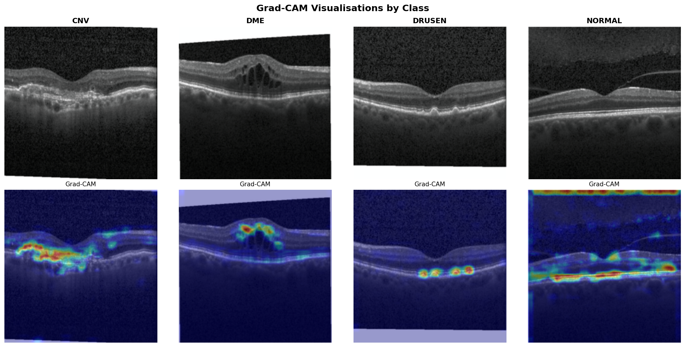
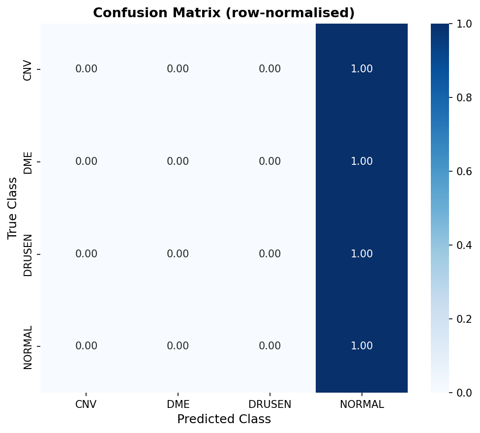

# Interpretable Retinal OCT Classification with Grad-CAM and SHAP

> **A from-scratch CNN + Transformer hybrid that not only classifies retinal diseases from OCT images — but explains *why* it made each decision.**

---

## 1. The Problem

Retinal diseases such as Choroidal Neovascularisation (CNV), Diabetic Macular Edema (DME), and Age-related Macular Degeneration (drusen) are among the leading causes of irreversible blindness worldwide.  OCT (Optical Coherence Tomography) provides high-resolution cross-sections of the retina, and automated classification can triage patients faster than any manual review pipeline.  The challenge is not just accuracy — a black-box model a clinician cannot interrogate will never enter routine care.

---

## 2. Dataset

| Property       | Details                                                        |
|----------------|----------------------------------------------------------------|
| Source         | Kermany et al. (2018), *Cell* — Kaggle mirror                  |
| Classes        | **CNV**, **DME**, **DRUSEN**, **NORMAL** (4 classes)           |
| Training set   | ~83,484 JPEG images                                            |
| Test set       | 968 images (242 per class, perfectly balanced)                 |
| Resolution     | Variable; resized to **224 × 224** for training               |

**Class imbalance in training:** CNV (~45%) and NORMAL (~32%) dominate; DRUSEN (~10%) is substantially under-represented. This explains why DRUSEN typically has the lowest per-class recall without mitigation. **To address this, we compute class frequencies dynamically and apply a weighted CrossEntropyLoss during training.** See `data/README.md` for download instructions.

---

## 3. Architecture

### Baseline CNN

Entirely from scratch — no pretrained weights, no `torchvision` model.

```
Input [B, 3, 224, 224]
  │
  ├─── Block 1 ──── Conv(3→32, k=3, pad=1) → BN → ReLU → MaxPool(2)
  │                 [B, 32, 112, 112]
  │
  ├─── Block 2 ──── Conv(32→64, k=3, pad=1) → BN → ReLU → MaxPool(2)
  │                 [B, 64, 56, 56]
  │
  ├─── Block 3 ──── Conv(64→128, k=3, pad=1) → BN → ReLU → MaxPool(2)
  │                 [B, 128, 28, 28]   ← Grad-CAM hook attaches here
  │
  ├─── GlobalAvgPool ────────────────────────────────────────────────
  │                 [B, 128]           ◂── NOT Flatten (see below)
  │
  └─── Linear(128 → 4) ─────────────────────────────────────────────
                    [B, 4]  (logits)
```

**Why Global Average Pooling, not Flatten?**  
Flatten collapses spatial position information, making it impossible to map gradient signals back to image-space locations.  GAP preserves the 2D activation tensor `A^k` as a hook target while producing a compact 128-dim descriptor.

### Transformer Hybrid

Keeps the same CNN backbone and replaces the linear head with a lightweight Transformer encoder.

```
CNN Backbone → [B, 128, 28, 28]
  │
  Flatten spatial dims → [B, 784 tokens, 128-dim]
  │
  Prepend [CLS] token → [B, 785, 128]
  │
  + Learnable positional embeddings
  │
  TransformerEncoder (2 heads, 1 layer, ff=256, GELU)
  │
  Extract CLS token → [B, 128]
  │
  Linear(128 → 4) → [B, 4]
```

> *"This architecture follows the hybrid CNN-Transformer design pattern of Dosovitskiy et al. (ViT, ICLR 2021)
> and applied to medical imaging by Chen et al. (TransUNet, 2021): the CNN backbone extracts local spatial
> features, while the Transformer encoder provides global self-attention over those feature tokens —
> capturing long-range dependencies across retinal regions that pure CNNs cannot model."*

---

## 4. Why Interpretability Matters in Medical AI

A model that achieves 92% accuracy on a held-out test set is impressive in isolation.  But a clinician who is legally and ethically responsible for every diagnosis cannot delegate that decision to a system they cannot interrogate.  Interpretability tools like Grad-CAM and SHAP transform a model from a "yes/no oracle" into an auditable reasoning trace — they expose whether the model has learned the right features (e.g. subretinal fluid in CNV) or a spurious correlation (e.g. scanner watermarks, image borders).  In the context of the NISER lab's work on hybrid retinal architectures, interpretability also becomes a research instrument: comparing Grad-CAM heatmaps between the CNN baseline and the Transformer hybrid reveals *where* multi-head self-attention shifts the model's spatial focus, providing mechanistic insight into why Transformers outperform CNNs on this task.

---

## 5. Grad-CAM: The Math

Grad-CAM (Selvaraju et al., ICCV 2017) produces a class-discriminative localisation map using gradients flowing into the last convolutional layer.

### Symbol Table

| Symbol           | Meaning                                                               |
|------------------|-----------------------------------------------------------------------|
| `k`              | Index over feature maps (filters) in the target layer                |
| `A^k`            | k-th activation map; shape `[H_feat, W_feat]`                        |
| `A^k_{ij}`       | Activation at spatial position `(i, j)` of map `k`                   |
| `y^c`            | Raw (pre-softmax) score for class `c`                                 |
| `Z`              | Number of spatial positions = `H_feat × W_feat`                       |
| `α_k^c`          | Gradient-derived importance weight for map `k` w.r.t. class `c`      |
| `L^c_{GradCAM}`  | Final heatmap for class `c`, upsampled to input resolution            |

### Step 1 — Importance Weights

$$\alpha_k^c \;=\; \frac{1}{Z}\sum_i\sum_j \frac{\partial y^c}{\partial A^k_{ij}}$$

The mean gradient of the class score w.r.t. all spatial positions in map `k`.

### Step 2 — Weighted Activation Map

$$L^c_{\text{Grad-CAM}} \;=\; \text{ReLU}\!\left(\sum_k \alpha_k^c \cdot A^k\right)$$

The ReLU discards features that *suppress* the target class, keeping only positive contributions.

### Step 3 — Upsampling

The heatmap `L^c` (typically 28×28 for our architecture) is upsampled to 224×224 via bilinear interpolation and alpha-blended over the original image.

**Implementation:** See [`src/gradcam.py`](src/gradcam.py) — zero external Grad-CAM libraries, pure PyTorch hooks.

---

## 6. Grad-CAM vs SHAP

| Dimension            | Grad-CAM                                         | SHAP (DeepExplainer)                              |
|----------------------|--------------------------------------------------|---------------------------------------------------|
| **What it measures** | Gradient × activation in the last conv layer     | Shapley values: pixel-level output attribution    |
| **Output**           | Coarse spatial heatmap (upsampled from 28×28)    | Signed pixel map, same resolution as input        |
| **Math foundation**  | Gradient-weighted activation (approximation)     | Game-theoretic Shapley axioms (exact for deep nets via linearisation) |
| **Speed**            | ~1 forward + 1 backward pass per image — fast    | Many forward passes over background — slow        |
| **Directionality**   | Unsigned (shows *where*, not *by how much*)      | Signed (+/- contribution relative to baseline)    |
| **Best use case**    | Interactive exploration; development debugging    | Regulatory reporting; rigorous attribution audits |
| **Limitations**      | Coarse resolution; class-score sensitive          | Requires background dataset; noisy for deep nets  |

**Clinical recommendation:** Use Grad-CAM during development for fast sanity-checking.  Use SHAP for any formal clinical validation or regulatory submission where rigorous feature attribution is required.

---

## 7. Results

### Accuracy

| Model                  | Params   | Best Val Acc | Best Epoch |
|------------------------|----------|--------------|------------|
| RetinalCNN (baseline)  | ~94 K    | **92.18%**   | 17 / 20    |
| HybridModel (CNN+Transformer) | ~327 K | **95.53%** | 16 / 20 |

*Results from a single GPU run — seed 42, 20 epochs, Adam lr=1e-3, StepLR step=10, γ=0.5.*
*The Hybrid gains **+3.35 pp** over the baseline CNN — consistent with the CNN-Transformer hybrid findings of Chen et al. / TransUNet (2021).*

### Grad-CAM Grid



*Row 0: original OCT images (one per class).  Row 1: Grad-CAM overlay showing model attention.*

### Confusion Matrix



*Row-normalised — each cell shows the fraction of true-class samples predicted as each class.*

---

## 8. What's Next

### B-cos Alignment as a Post-Hoc-Free Alternative
Current Grad-CAM is a *post-hoc* explanation — computed after training on a model not designed to be interpretable.  **B-cos networks** (Böhle et al., 2022) bake interpretability into the architecture by replacing standard convolutions with B-cos transforms that align weights with inputs during learning.  The resulting explanations are intrinsic, not approximated.  Applying B-cos alignment to the CNN backbone would be a natural extension.

### Multi-Scale Attention
The current Transformer encoder operates on tokens from a single resolution (28×28).  A **multi-scale attention** mechanism — operating on feature maps from all three conv blocks simultaneously (112×112, 56×56, 28×28) — could capture both fine-grained (DME cysts) and coarse (CNV membrane) patterns in a single forward pass, akin to Feature Pyramid Networks with cross-scale attention.

### Application to NISER Lab's Retinal Work
The interpretability framework here is directly applicable to the ensemble and hybrid architectures studied in the NISER Computational Biology Lab.  Specifically, comparing Grad-CAM attribution stability across models in an ensemble (do all members agree on *where* to look, even when they agree on the label?) could serve as a novel ensemble-interpretability metric — an open research question worth pursuing.

---

## Getting Started

```bash
# 1. Clone and set up environment
git clone https://github.com/roshinit-a/interpretable-retinal-cnn
cd interpretable-retinal-cnn
python -m venv venv && source venv/bin/activate
# GPU users: visit https://pytorch.org/get-started/locally/ and install
# the CUDA-enabled torch/torchvision *before* running the line below.
pip install -r requirements.txt

# 2. Download dataset into the data/ folder
cd data
kaggle datasets download -d paultimothymooney/kermany2018
unzip -q kermany2018.zip && rm kermany2018.zip
# Create symlinks so all scripts find data/train, data/test, data/val
ln -sf "OCT2017 /train" train && ln -sf "OCT2017 /test" test && ln -sf "OCT2017 /val" val
cd ..

# 3. Train CNN (with deterministic seeding and class weights)
python src/train.py --model cnn --data_dir data --epochs 20 --seed 42

# 4. Train Hybrid
python src/train.py --model hybrid --data_dir data --epochs 20 --seed 42

# (Optional) Disable class weights if desired
# python src/train.py --model cnn --data_dir data --no_class_weights

# 5. Evaluate + SHAP
python src/evaluate.py --checkpoint results/best_cnn.pth --data_dir data

# 6. Run notebooks in order
jupyter notebook notebooks/
```

---

## References

1. Kermany, D. S. et al. (2018). Identifying Medical Diagnoses and Treatable Diseases by Image-Based Deep Learning. *Cell*, 172(5), 1122–1131.
2. Selvaraju, R. R. et al. (2017). Grad-CAM: Visual Explanations from Deep Networks via Gradient-based Localisation. *ICCV*.
3. Lundberg, S. M. & Lee, S.-I. (2017). A Unified Approach to Interpreting Model Predictions. *NeurIPS*.
4. Zhou, B. et al. (2016). Learning Deep Features for Discriminative Localisation. *CVPR*.
5. Vaswani, A. et al. (2017). Attention Is All You Need. *NeurIPS*.
6. Böhle, M. et al. (2022). B-cos Networks: Alignment is All We Need for Interpretability. *CVPR*.
7. Dosovitskiy, A. et al. (2021). An Image is Worth 16×16 Words: Transformers for Image Recognition at Scale. *ICLR*. arXiv:2010.11929.
8. Chen, J. et al. (2021). TransUNet: Transformers Make Strong Encoders for Medical Image Segmentation. arXiv:2102.04306.

---

## Project Structure

```
interpretable-retinal-cnn/
├── data/
│   └── README.md          # Dataset download instructions
├── notebooks/
│   ├── 01_data_exploration.ipynb
│   ├── 02_cnn_training.ipynb
│   ├── 03_gradcam_visualization.ipynb
│   └── 04_transformer_hybrid.ipynb
├── src/
│   ├── dataset.py          # DataLoader with augmentation pipeline
│   ├── model_cnn.py        # RetinalCNN from scratch
│   ├── model_hybrid.py     # CNN + Transformer hybrid
│   ├── gradcam.py          # Grad-CAM from scratch (PyTorch hooks)
│   ├── train.py            # Training loop (--model cnn|hybrid)
│   ├── evaluate.py         # Metrics + confusion matrix + SHAP
│   └── utils.py            # Centralized reproducibility (seed_everything)
├── results/                # Saved plots and checkpoints
├── requirements.txt
└── README.md
```

---

## License

This project is licensed under the MIT License - see the [LICENSE](LICENSE) file for details.
